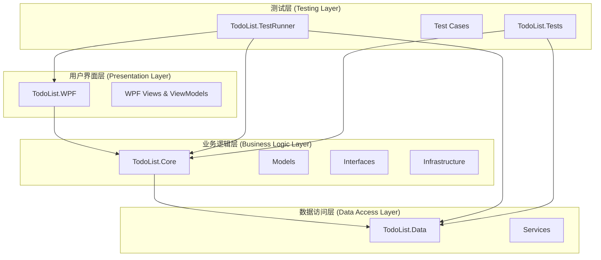
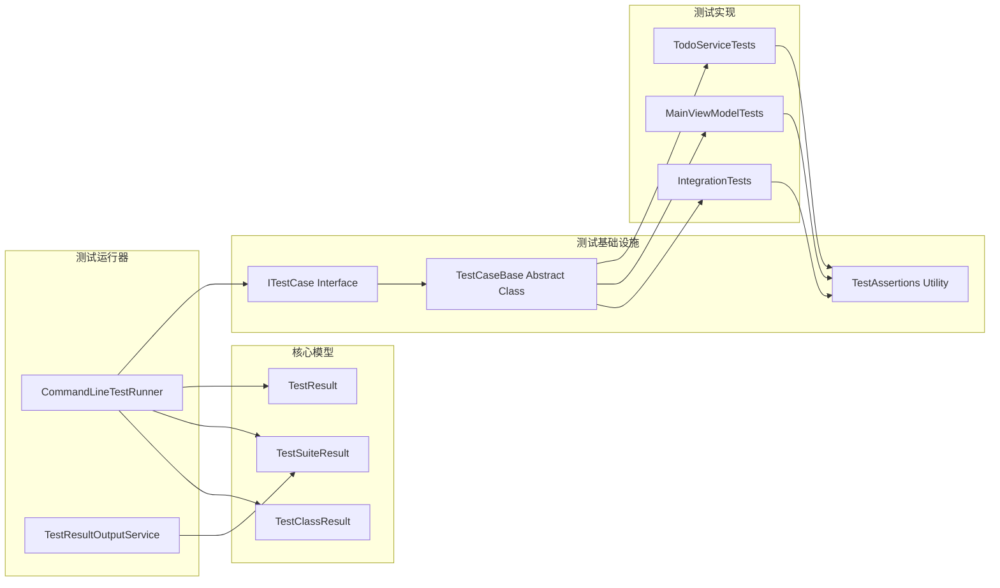
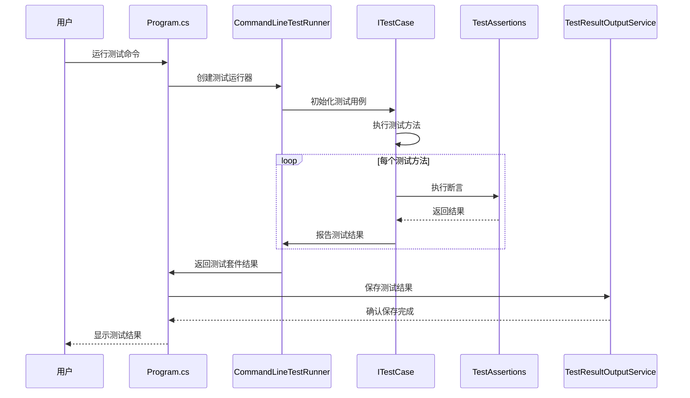
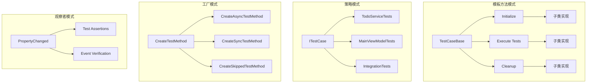
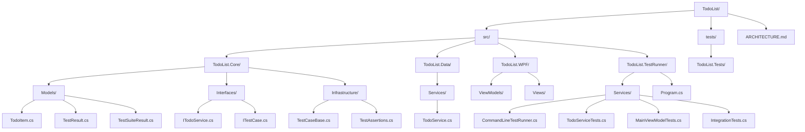
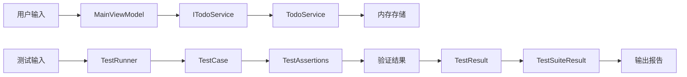

# TodoList 项目架构图

## 🏗️ 整体架构

```mermaid
graph TB
    subgraph "用户界面层 (Presentation Layer)"
        WPF[TodoList.WPF]
        UI[WPF Views & ViewModels]
    end
    
    subgraph "业务逻辑层 (Business Logic Layer)"
        Core[TodoList.Core]
        Models[Models]
        Interfaces[Interfaces]
        Infrastructure[Infrastructure]
    end
    
    subgraph "数据访问层 (Data Access Layer)"
        Data[TodoList.Data]
        Services[Services]
    end
    
    subgraph "测试层 (Testing Layer)"
        TestRunner[TodoList.TestRunner]
        Tests[Test Cases]
        TraditionalTests[TodoList.Tests]
    end
    
    WPF --> Core
    Core --> Data
    TestRunner --> Core
    TestRunner --> Data
    TestRunner --> WPF
    TraditionalTests --> Core
    TraditionalTests --> Data
```

## 🔧 核心组件关系

```mermaid
graph LR
    subgraph "测试基础设施"
        ITestCase[ITestCase Interface]
        TestCaseBase[TestCaseBase Abstract Class]
        TestAssertions[TestAssertions Utility]
    end
    
    subgraph "测试实现"
        TodoServiceTests[TodoServiceTests]
        MainViewModelTests[MainViewModelTests]
        IntegrationTests[IntegrationTests]
    end
    
    subgraph "测试运行器"
        CommandLineTestRunner[CommandLineTestRunner]
        TestResultOutputService[TestResultOutputService]
    end
    
    subgraph "核心模型"
        TestResult[TestResult]
        TestSuiteResult[TestSuiteResult]
        TestClassResult[TestClassResult]
    end
    
    ITestCase --> TestCaseBase
    TestCaseBase --> TodoServiceTests
    TestCaseBase --> MainViewModelTests
    TestCaseBase --> IntegrationTests
    
    TodoServiceTests --> TestAssertions
    MainViewModelTests --> TestAssertions
    IntegrationTests --> TestAssertions
    
    CommandLineTestRunner --> ITestCase
    CommandLineTestRunner --> TestResult
    CommandLineTestRunner --> TestSuiteResult
    CommandLineTestRunner --> TestClassResult
    
    TestResultOutputService --> TestSuiteResult
```

## 📊 测试流程

```mermaid
sequenceDiagram
    participant User as 用户
    participant Program as Program.cs
    participant Runner as CommandLineTestRunner
    participant TestCase as ITestCase
    participant Assertions as TestAssertions
    participant Output as TestResultOutputService
    
    User->>Program: 运行测试命令
    Program->>Runner: 创建测试运行器
    Runner->>TestCase: 初始化测试用例
    TestCase->>TestCase: 执行测试方法
    
    loop 每个测试方法
        TestCase->>Assertions: 执行断言
        Assertions-->>TestCase: 返回结果
        TestCase->>Runner: 报告测试结果
    end
    
    Runner->>Program: 返回测试套件结果
    Program->>Output: 保存测试结果
    Output-->>Program: 确认保存完成
    Program-->>User: 显示测试结果
```

## 🎯 设计模式应用

```mermaid
graph TD
    subgraph "模板方法模式"
        A[TestCaseBase] --> B[Initialize]
        A --> C[Execute Tests]
        A --> D[Cleanup]
        B --> E[子类实现]
        C --> F[子类实现]
        D --> G[子类实现]
    end
    
    subgraph "策略模式"
        H[ITestCase] --> I[TodoServiceTests]
        H --> J[MainViewModelTests]
        H --> K[IntegrationTests]
    end
    
    subgraph "工厂模式"
        L[CreateTestMethod] --> M[CreateAsyncTestMethod]
        L --> N[CreateSyncTestMethod]
        L --> O[CreateSkippedTestMethod]
    end
    
    subgraph "观察者模式"
        P[PropertyChanged] --> Q[Test Assertions]
        P --> R[Event Verification]
    end
```

## 📁 文件结构树

```mermaid
graph TD
    A[TodoList/] --> B[src/]
    A --> C[tests/]
    A --> D[ARCHITECTURE.md]
    
    B --> E[TodoList.Core/]
    B --> F[TodoList.Data/]
    B --> G[TodoList.WPF/]
    B --> H[TodoList.TestRunner/]
    
    E --> I[Models/]
    E --> J[Interfaces/]
    E --> K[Infrastructure/]
    
    I --> L[TodoItem.cs]
    I --> M[TestResult.cs]
    I --> N[TestSuiteResult.cs]
    
    J --> O[ITodoService.cs]
    J --> P[ITestCase.cs]
    
    K --> Q[TestCaseBase.cs]
    K --> R[TestAssertions.cs]
    
    F --> S[Services/]
    S --> T[TodoService.cs]
    
    G --> U[ViewModels/]
    G --> V[Views/]
    
    H --> W[Services/]
    H --> X[Program.cs]
    
    W --> Y[CommandLineTestRunner.cs]
    W --> Z[TodoServiceTests.cs]
    W --> AA[MainViewModelTests.cs]
    W --> BB[IntegrationTests.cs]
    
    C --> CC[TodoList.Tests/]
```

## 🔄 数据流

```mermaid
flowchart LR
    A[用户输入] --> B[MainViewModel]
    B --> C[ITodoService]
    C --> D[TodoService]
    D --> E[内存存储]
    
    F[测试输入] --> G[TestRunner]
    G --> H[TestCase]
    H --> I[TestAssertions]
    I --> J[验证结果]
    J --> K[TestResult]
    K --> L[TestSuiteResult]
    L --> M[输出报告]
```

## 🎨 主题适配

这些图表在暗黑主题下都能清晰显示，使用了：
- 高对比度的颜色
- 清晰的边界线
- 易读的字体
- 合理的分组和层次
